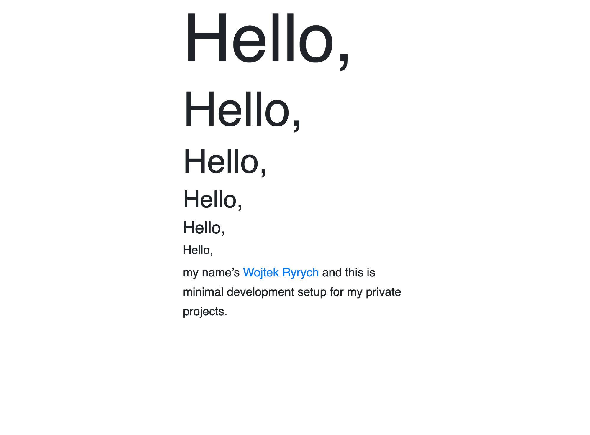

# Front-end starter

Minimal development setup for my private projects based on [webpack](https://webpack.js.org/). To test the setup I modified some of the Bootstrap defaults in `src/basics/typography/typography.scss`:

- Grid
- Typographic scale based on on 1.414 (Augmented Fourth) scale
- Measure of 40 characters per line



## Project structure

Project structure in `src/` reflects popular way of spliting design systems into:

- Basics
- Components
- Templates

Some of the design systems that inspire me:

- [brand estonia](https://brand.estonia.ee/)
- [Mailchimp](https://ux.mailchimp.com/patterns/color)
- [Polaris](https://polaris.shopify.com/)
- [Audi](https://www.audi.com/ci/en/intro/brand-appearance.html)

You can find more design system with: [Website Style Guide Resources](http://styleguides.io/) and [Adele](https://adele.uxpin.com/)
If you want to learn more about structering design systems, I encourage you to read: [Atomic Design](https://atomicdesign.bradfrost.com/) by [Brad Frost](http://bradfrost.com/) and [Design Systems](https://designsystemsbook.com/) by [Alla Kholmatova](http://craftui.com/).

## How to run

```sh
nvm install --lts
nvm use --lts
npm install
npm run server
```

For production:

```sh
npm run build
```

## Info about missing fonts

By default fonts are not included, but defined in `src/basics/typography/typography.scss`.

## Have fun!
